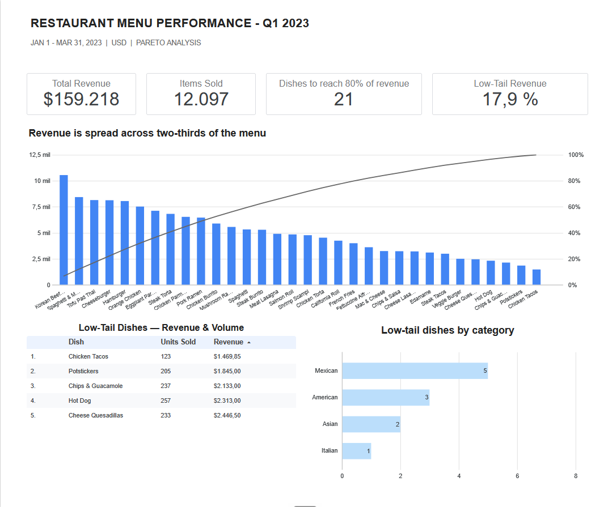

# Restaurant Menu Performance — Q1 2023

Sales concentration analysis across a 32-dish menu and 12,097 order lines, built to answer a single operational question: which dishes does the owner protect, and which ones does he look at again before the next menu print.

**[View the dashboard →](https://datastudio.google.com/reporting/05811f69-bf0a-4ad5-89ad-280ba30eaa01/page/JN08F)** · **[View the workbook →](https://docs.google.com/spreadsheets/d/13LieJ6vMYcU2lKXQK7Z7XYfRnggjsOnbAEpeQhEgif4/edit)**

---

## Key Findings

**1. Revenue is spread across two-thirds of the menu, not concentrated in a few dishes.**
The six highest-revenue dishes generate 31.9% of Q1 revenue. A classic 80/20 menu would put that number near 80%; a perfectly even menu would put it at 18.8%. Reaching 80% of revenue takes 21 of 32 dishes, and the single best-selling dish accounts for 6.6% of the total. There is no small group of star dishes holding up the quarter.

**2. The low tail sells more than it earns — most of it is a price effect, not a demand problem.**
The 11 dishes below the 80% cutoff are 34.4% of the menu, but they move 26.9% of all units while producing only 17.9% of revenue. The gap between those two figures is price. Edamame is the clearest case: 620 units sold, the second most-ordered dish on the entire menu, sitting in the tail because it lists at $5.00.

**3. One dish is low on both counts.**
Chicken Tacos sold 123 units in the quarter for $1,469.85 — last in revenue and last in units. It is the only dish in the tail where low volume and low revenue point the same direction, and the only one where the number alone justifies a closer look.

---

## The Question

An independent full-service restaurant owner has to decide where to put operational and purchasing attention: which dishes he protects, which ones he investigates before touching, and which ones go into review for the next menu.

He is **not** deciding what to remove. This data cannot support that decision, and the analysis does not pretend otherwise — see *What This Data Cannot Answer*.

The owner needs two things answered in under two minutes:

- Which dishes carry my revenue?
- How much of my menu isn't working?

Every chart in the dashboard earns its place by answering one of those two.

---

## The Data

**Source:** Maven Analytics "Restaurant Orders" — a Q1 2023 transactional dataset from a single location.

| | |
|---|---|
| Menu | 32 dishes across 4 categories (American, Asian, Italian, Mexican), $5.00–$19.95 |
| Orders | 12,234 order lines across 5,370 distinct orders, Jan 1 – Mar 31, 2023 |
| Grain | One row = one item ordered. Order lines ≠ orders |
| Used in analysis | 12,097 order lines · $159,217.90 in revenue |

**Cleaning.** 137 order lines (1.12%) carry the literal text `NULL` in `item_id` and match no menu item. A completeness check that only asks whether a cell is blank passes these rows — they are not empty, they contain a string. They surfaced when the completeness check and the referential integrity check disagreed with each other. They were excluded from the clean layer; the raw tabs were never modified.

Coverage was verified at 90 distinct dates across 90 days, so no missing days skew the day-of-week view.

---

## Recommendations

**1. Do not cut the menu by revenue rank.**
The 11 dishes in the tail account for 26.9% of everything leaving the kitchen. Removing them does not remove 18% of revenue — it removes more than a quarter of the volume, and there is no data here on which ingredients those dishes share with the dishes that sell well. A low-revenue dish that shares its prep with three popular ones saves nothing when it's pulled.

**2. Price the short list against comparable restaurants nearby.**
Take the five dishes above and compare each against its equivalent at four or five restaurants of similar concept and price range in the area. Appetizers compare to appetizers, entrées to entrées. The result reads two ways: if these dishes sit below the local norm, price is the lever; if they sit at the norm, the problem is demand and repricing won't fix it. Costs nothing but time, and it starts this week.

**3. Start collecting per-dish recipe costing.**
This is the data that would turn a revenue ranking into a margin ranking. It has to be ingredients and quantities per dish — an average food cost rate applied across the menu leaves the ranking mathematically identical to a ranking by price, which answers nothing. Until that exists, no one can say which of these dishes actually contributes.

---

## What This Data Cannot Answer

This dataset contains prices, not costs. Every conclusion here is stated in units sold and revenue generated — never in profit. A dish that ranks low in revenue is not necessarily a dish that loses money, and this analysis does not claim otherwise.

Three questions stay open, and each one names the data that would close it:

- **Which dishes actually contribute to profit?** Requires per-dish recipe costing — ingredients and quantities, not an average food cost rate.
- **What does removing a dish actually save?** Requires the ingredient map. A low-selling dish shares inventory with dishes that sell well.
- **Is this quarter representative?** One quarter, one location, no year-over-year comparison and no seasonality baseline.

The dataset also carries no customer or channel data, so dine-in, counter and delivery are indistinguishable.

---

**Tools:** Google Sheets · Looker Studio · Q1 2023 dataset from Maven Analytics
